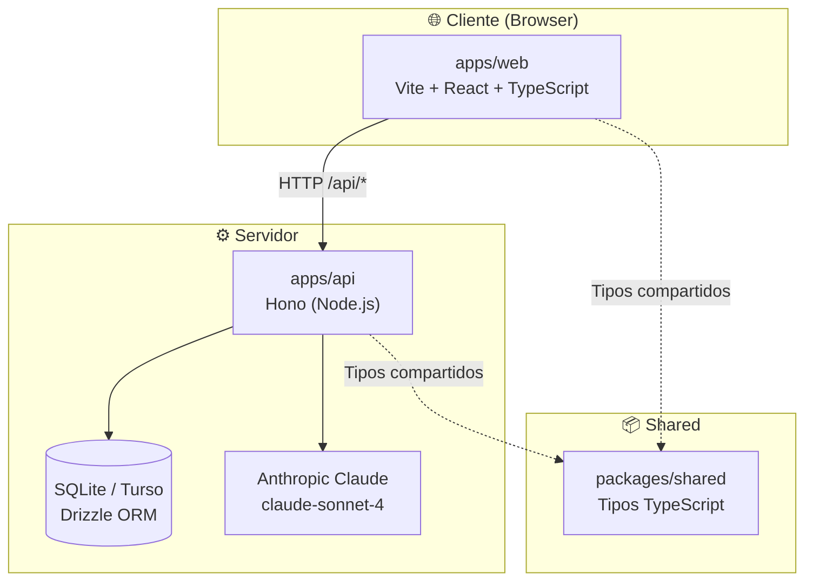
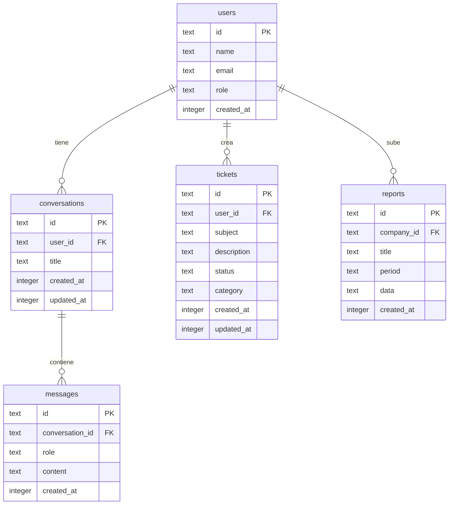
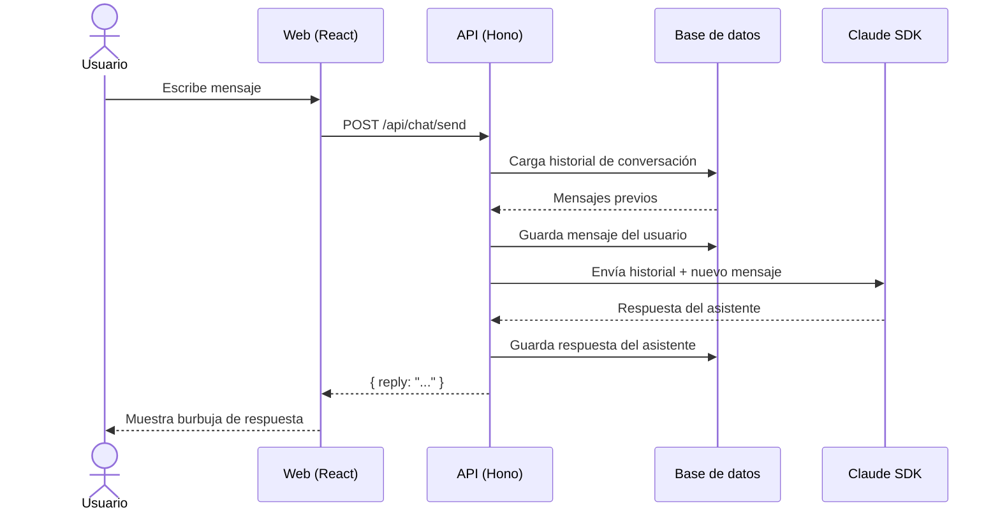
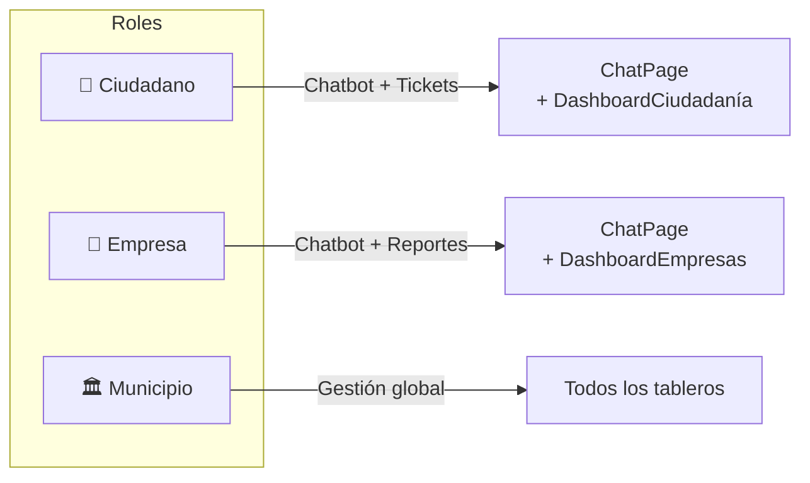
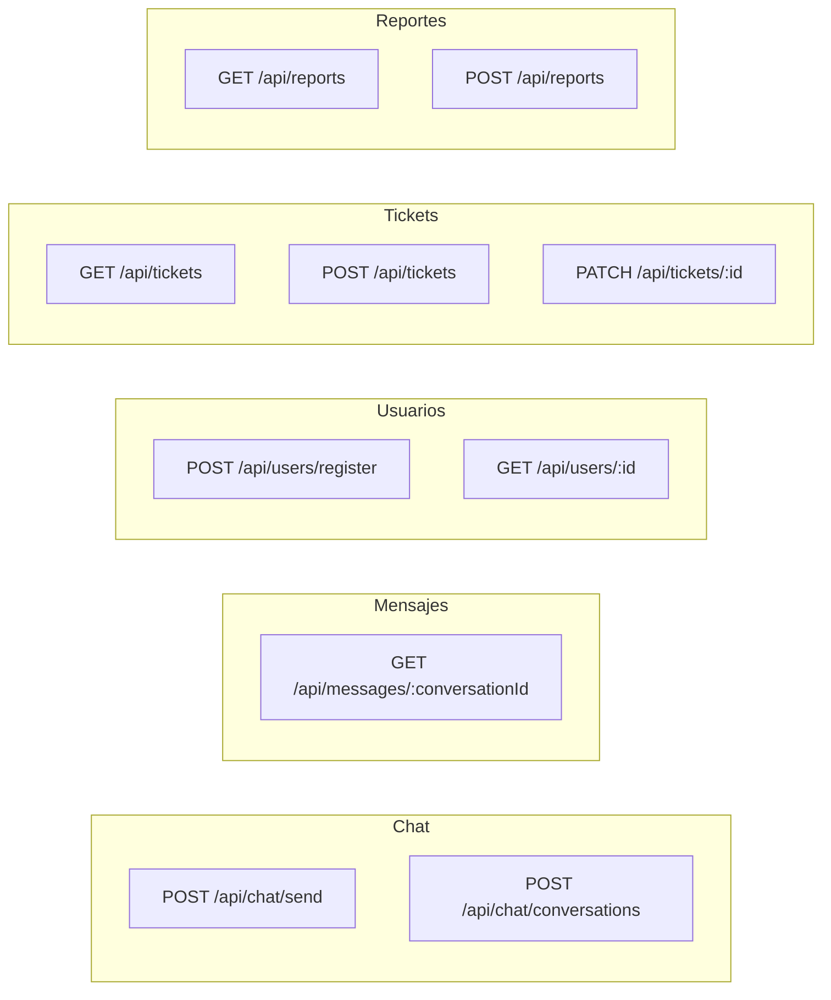
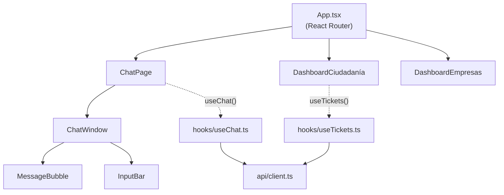

# 🏛️ Municipio App — Scaffolding Hackathon

Plataforma full-stack para la interacción entre **Municipio, Empresas y Ciudadanía**, con chatbot IA integrado, tablero de tickets y panel de reportes empresariales.

---

## 📐 Arquitectura general



---

## 📁 Estructura de directorios

```
municipio-app/
├── package.json            ← Monorepo (npm workspaces)
├── tsconfig.base.json      ← Config TypeScript compartida
├── .env.example
│
├── apps/
│   ├── api/                ← Backend Hono
│   └── web/                ← Frontend Vite + React
│
└── packages/
    └── shared/             ← Tipos compartidos API ↔ Frontend
```

---

## 🗄️ Modelo de datos



---

## 🔀 Flujo del chatbot (ciudadano)



---

## 🎭 Roles de usuario



---

## 🔌 API — Endpoints



| Método | Ruta | Descripción | Auth |
|--------|------|-------------|------|
| `GET` | `/health` | Estado del servidor | ✗ |
| `POST` | `/api/users/register` | Registrar usuario | ✗ |
| `GET` | `/api/users/:id` | Obtener usuario | ✗ |
| `POST` | `/api/chat/conversations` | Nueva conversación | ✓ |
| `POST` | `/api/chat/send` | Enviar mensaje al chatbot | ✓ |
| `GET` | `/api/messages/:conversationId` | Historial de mensajes | ✓ |
| `GET` | `/api/tickets` | Listar tickets | ✓ |
| `POST` | `/api/tickets` | Crear ticket | ✓ |
| `PATCH` | `/api/tickets/:id` | Actualizar estado de ticket | ✓ |
| `GET` | `/api/reports` | Listar reportes | ✓ |
| `POST` | `/api/reports` | Subir reporte | ✓ |

---

## 🖥️ Frontend — Páginas y componentes



---

## ⚡ Quick Start

### 1. Prerrequisitos

- Node.js ≥ 20
- npm ≥ 10
- Cuenta en [Anthropic](https://console.anthropic.com/) para obtener `ANTHROPIC_API_KEY`

### 2. Instalación

```bash
cd municipio-app
cp .env.example .env
# Edita .env con tus valores reales
npm install
```

### 3. Base de datos

```bash
npm run db:migrate   # Crea las tablas en SQLite local
```

### 4. Desarrollo

```bash
npm run dev
# API  → http://localhost:3001
# Web  → http://localhost:5173
```

### 5. Verificación

```bash
curl http://localhost:3001/health
# {"status":"ok","ts":"..."}
```

---

## 🔧 Variables de entorno

| Variable | Descripción | Ejemplo |
|----------|-------------|---------|
| `PORT` | Puerto del servidor API | `3001` |
| `FRONTEND_URL` | Origen permitido por CORS | `http://localhost:5173` |
| `DATABASE_URL` | URL de la base de datos | `file:local.db` |
| `DATABASE_TOKEN` | Token Turso (vacío en local) | — |
| `ANTHROPIC_API_KEY` | Clave de la API de Anthropic | `sk-ant-...` |
| `VITE_API_URL` | Base URL de la API desde el frontend | `/api` |

---

## 🗺️ Stack tecnológico

| Capa | Tecnología |
|------|-----------|
| Backend | [Hono](https://hono.dev/) + [@hono/node-server](https://github.com/honojs/node-server) |
| ORM | [Drizzle ORM](https://orm.drizzle.team/) |
| Base de datos | SQLite local / [Turso](https://turso.tech/) en producción |
| IA | [Anthropic Claude](https://www.anthropic.com/) (`claude-sonnet-4`) |
| Frontend | [Vite](https://vitejs.dev/) + [React 18](https://react.dev/) + TypeScript |
| Router | [React Router v6](https://reactrouter.com/) |
| Validación | [Zod](https://zod.dev/) + [@hono/zod-validator](https://github.com/honojs/middleware/tree/main/packages/zod-validator) |
| Monorepo | npm workspaces |

---

## 🗺️ Próximos pasos

| Área | Tarea |
|------|-------|
| Auth | Integrar `hono/jwt` + login page con roles |
| UI | Agregar Tailwind CSS o CSS Modules con tema municipal |
| AI | Streaming de respuestas con `stream: true` del SDK |
| DB | Migrar a Turso en la nube para staging |
| Deploy | Cloudflare Workers (API) + Cloudflare Pages (Web) |
| Tests | Vitest para hooks, Hono test utils para rutas |

